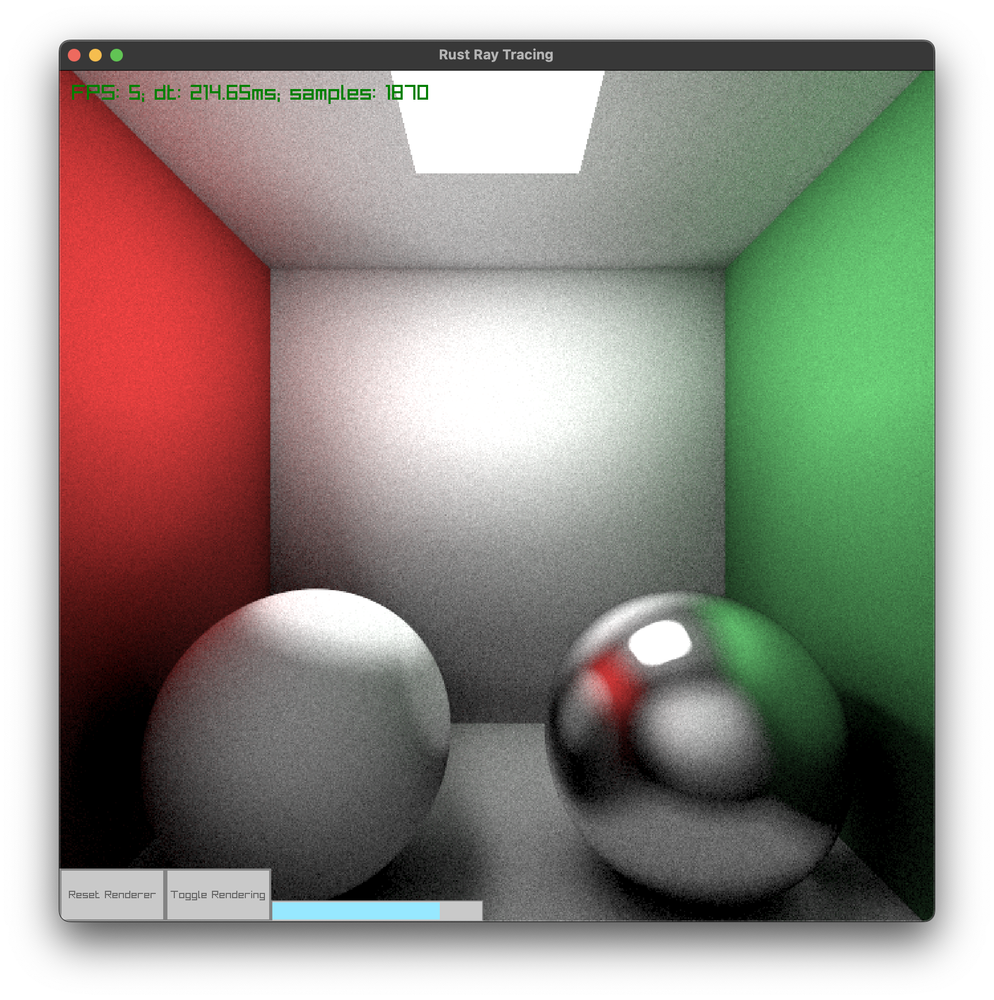

# Rust-RT

A multithreaded ray tracer written for the purpose of starting to learn
Rust! Capable of rendering spheres, planes, and quads with emissive, 
lambertian, and metal materials. Uses rayon for parallelization.

